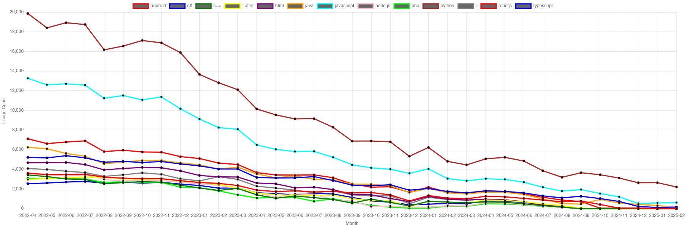
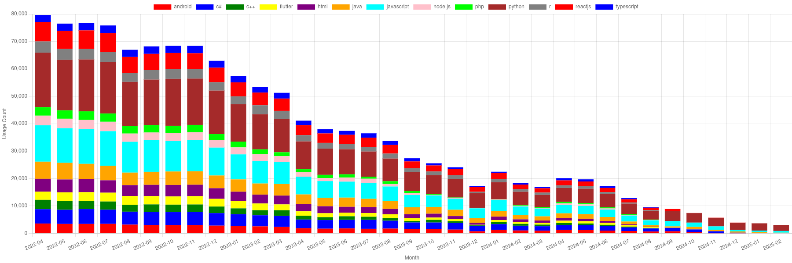
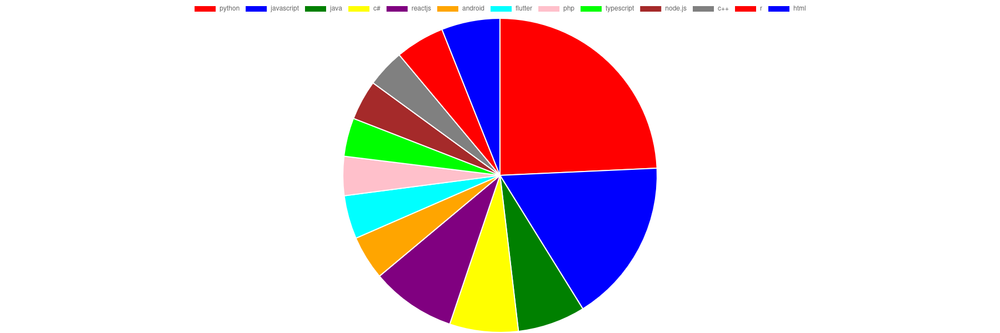
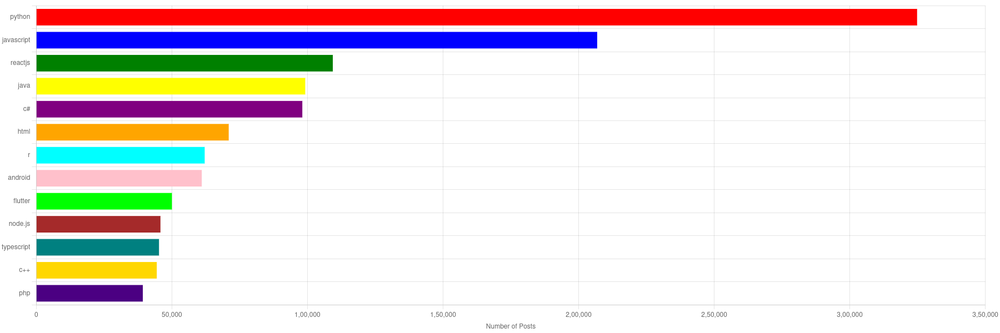

# 📊 From Tags to Trends: Stack Overflow Insights (2022–2025)

### 📉 Popularity Trends Over Time  

Welcome to my Stack Overflow Trends Analysis project!  
This project is all about tracking how developer interests have changed over the past few years by analyzing tag data from Stack Overflow posts between **2022 and 2025**.

[🔗 **Live Project Demo**](https://rajiv1478.netlify.app/projects)

---

## ✨ Project Summary  

I wanted to see which programming languages, frameworks, and technologies developers have been asking about the most — and how those trends have shifted over time.  

### Key Goals:
- 📌 Find the most used tags on Stack Overflow from **2022 to 2025**
- 📈 Analyze which technologies have gained or lost popularity
- 🌟 Spot new tools and frameworks rising among developers

---

## 🛠️ How I Did It  

- Collected tags and timestamps from Stack Overflow questions  
- Grouped the data by month to get a clear timeline of trends  
- Visualized everything with bar charts, pie charts, and trend lines  

---

## 📊 Visual Highlights  

### 🗓️ Monthly Tag Usage  

---

### 🎯 Overall Tag Distribution  

---

### 🏆 Top Tags by Total Posts  

---

---

## 🔍 What I Learned  

- **Python** and **JavaScript** remain the most popular tags overall  
- Languages like **Java** and **C++** have seen a gradual decline  
- Frameworks like **TypeScript**, **ReactJS**, and **Flutter** are gaining attention  
- Overall Stack Overflow engagement seems to be dropping — could be due to changing platforms or community behavior  

---

## 🚀 Check It Out  

Take a look at the live project here:  
[👉 **Live Project Link**](https://rajiv1478.netlify.app/projects)

---

---

## 📌 Final Thoughts  

This project gave me a great insight into how the tech world changes and how developer interest shifts with time.  
It’s a useful reference for anyone curious about programming trends or looking to explore Stack Overflow data analysis.

---

## 👋 About Me  

**Rajiv Kumar**  
🌐 [My Portfolio](https://rajiv1478.netlify.app)  

---

